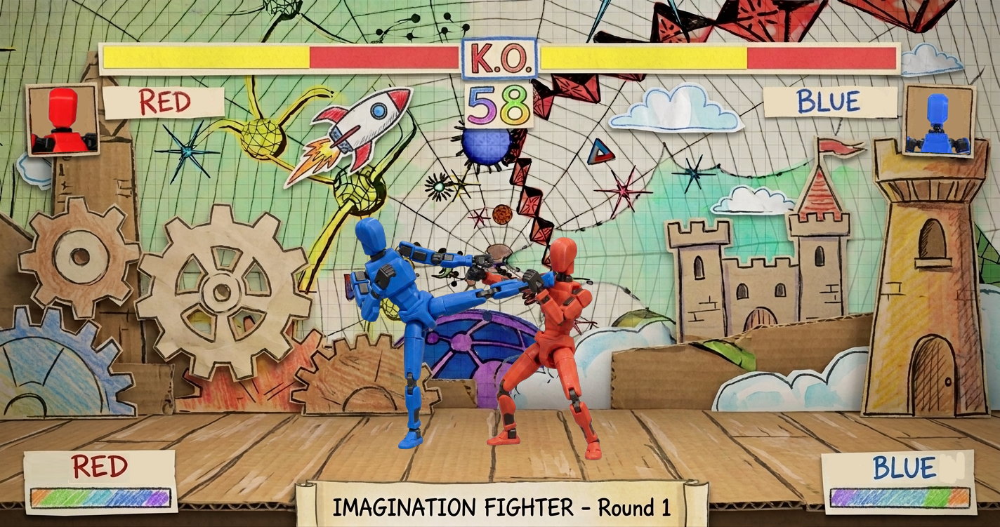

# GAME DESIGN DOCUMENT (GDD)

**Nombre del Juego:** Imagination Fighter  
**Versión:** 0.1.0  
**Fecha de actualización:** 28/08/2026

---

## Ficha del Grupo

| Apellido y Nombre Completo | Función dentro del grupo |
|---|---|
| Julio Rodríguez | Game Designer / Programmer / Art |

---

# 1. High Concept y Visión Inicial

### High Concept

**Imagination Fighter** es un videojuego de lucha en el que distintos personajes se enfrentan en combates uno contra uno dentro de un mundo inspirado en la imaginación infantil. Su identidad visual combina figuras articuladas, estética de stop-motion y escenarios construidos a partir de materiales como papel, cartón y dibujos hechos a mano.
El proyecto busca utilizar una estética caricaturesca como principal elemento diferenciador dentro de un género de videojuegos ampliamente conocido.

---

# 2. Estructura Core del Proyecto

## 2.1 Objetivo del Proyecto

El objetivo principal del proyecto es desarrollar un videojuego de lucha que permita demostrar la viabilidad de su propuesta jugable y estética.
Desde el punto de vista del diseño, se busca construir un sistema de combate que resulte entretenido, tomando como referencia los videojuegos de pelea.
El proyecto busca explorar una dirección visual basada en la imaginación y en la utilización de materiales físicos representados digitalmente, principalmente papel, cartón, dibujos, recortes y figuras articuladas.
Desde el punto de vista académico, el proyecto tiene como objetivo integrar conocimientos adquiridos durante la Tecnicatura en Diseño y Programación de Videojuegos, especialmente aquellos relacionados con diseño de videojuegos, programación, interfaces y producción.

---

## 2.2 Diseño e investigación

### Definición de la idea

*Imagination Fighter* es un videojuego de pelea basado en la imaginación de un niño de 10 años, donde las figuras y dibujos que forman parte de su imaginación cobran vida y se enfrentan entre sí.
Los combates se desarrollan en escenarios que buscan representar espacios construidos manualmente, utilizando materiales como papel, cartón y dibujos.
Los personajes estarán representados mediante figuras articuladas, buscando transmitir la apariencia de objetos físicos animados mediante la técnica stop-motion.
Los efectos visuales también seguirán una estética caricaturesca y artesanal, utilizando recursos gráficos que puedan parecer dibujados a mano.
La propuesta no busca modificar las bases del género de pelea, sino diferenciarse mediante una identidad temática y audiovisual propia, centrada en la imaginación infantil.

### Género

**Género principal:** Acción.

**Subgénero:** Lucha uno contra uno (1v1).

### Referencias

Entre las principales referencias se encuentran:

- Videojuegos de pelea conocidos como *Street Fighter*, *Mortal Kombat* y *Tekken*.

- Videojuegos con animaciones stop-motion como *Harold Halibut* y *Out of Words*.

- Las secuencias de créditos de *Spider-Man: No Way Home*.

### Público objetivo

El público objetivo de *Imagination Fighter* está compuesto principalmente por niños, adolescentes y adultos jóvenes, aproximadamente entre los 5 y 25 años.
La propuesta busca atraer especialmente a un público infantil y juvenil mediante su estética.
Al mismo tiempo, el juego está dirigido a jugadores casuales y jugadores habituales del género de pelea.

### Mecánicas principales

- Movimiento horizontal del personaje.
- Ataques básicos.
- Ataques con diferentes propiedades.
- Defensa.
- Combos.
- Recepción de daño.
- Gestión de puntos de vida.
- Utilización de ataques especiales.
- Enfrentamiento contra otro personaje.
- Victoria y derrota de la ronda.

---

## 2.3 Concepto del Juego

En *Imagination Fighter*, los personajes existen dentro de un mundo nacido de la imaginación de un niño. Lo que en un entorno cotidiano serían dibujos, objetos simples, figuras articuladas se transforma en elementos de un universo de pelea.
El jugador controla a uno de estos personajes y se enfrenta a otro luchador en diferentes escenarios. La estructura del juego se basa en combates uno contra uno, donde los jugadores utilizan ataques, defensa, combos y movimientos especiales para derrotar a su oponente.
La identidad de juego surge de la combinación entre un sistema de combate tradicional y una presentación visual artesanal. Los escenarios no buscan representar necesariamente lugares realistas, sino espacios que podrían haber sido imaginados, dibujados y construidos físicamente.
Los personajes estarán representados mediante figuras articuladas, buscando generar la sensación de que juguetes u objetos físicos fueron animados mediante la técnica stop-motion.
Los elementos de la interfaz también formarán parte de esta propuesta visual. Por ejemplo, las barras de vida podrán representarse mediante piezas de cartón o papel dibujadas a mano. Los efectos visuales seguirán dicha estetica.
El principal atractivo del juego será la combinación entre el género de lucha y esta identidad visual.

---

## 2.4 Premisas del Videojuego

### Premisa 1 — El mundo nace de la imaginación

Los escenarios y elementos del juego deben transmitir la sensación de pertenecer a un mundo imaginado y construido artesanalmente.

### Premisa 2 — Los personajes son objetos que cobran vida

Los personajes deben conservar características visuales que permitan reconocerlos como figuras físicas o articuladas.

### Premisa 3 — La estética artesanal es parte de la identidad

Papel, cartón, lápices, dibujos y recortes serán elementos fundamentales de la dirección artística.

### Premisa 4 — El combate debe ser el núcleo de la experiencia

La estética no debe reemplazar al gameplay. El sistema de combate debe ser claro, funcional y entretenido por sí mismo.

### Premisa 5 — Los efectos deben reforzar la imaginación

Los efectos visuales y sonoros deben mantener una estética y coherencia con el mundo del juego.

### Premisa 6 — Cada personaje debe tener identidad propia

Los personajes deberán diferenciarse visualmente y, en la medida del alcance del proyecto, también mediante sus estilos de combate, ataques y personalidad.

---

## 2.5 Condiciones del Desarrollo

### Motor y herramientas

El proyecto será desarrollado utilizando las siguientes herramientas:

- **Motor:** Unity.
- **Control de versiones y almacenamiento del proyecto:** Git y GitHub.
- **Edición y creación de imágenes:** Krita.
- **Preparación de sprites y recursos gráficos:** herramientas digitales y herramientas web cuando resulte necesario.
- **Generación de referencias e inspiración visual:** herramientas de inteligencia artificial como ChatGPT y Gemini.
- **Documentación:** Markdown mediante el archivo `GDD.md`.

### Metodología de desarrollo

El desarrollo seguirá un proceso iterativo basado en la creación de prototipos, pruebas, evaluación y refinamiento.
Se priorizará inicialmente la implementación y validación de las mecánicas fundamentales del combate.
Una vez comprobadas las mecánicas, se incorporarán progresivamente los elementos visuales propios de la propuesta.

### Tiempo de desarrollo

Se estima una dedicación aproximada de **4 horas diarias**, aunque este tiempo podrá variar según la disponibilidad.

### Limitaciones

La producción de animaciones mediante figuras articuladas, fotografía y edición de imágenes puede requerir un tiempo considerable.

---

## 2.6 Alcance del proyecto

El objetivo del Proyecto Final será desarrollar una version jugable de *Imagination Fighter* que permita demostrar la propuesta principal del videojuego.

### Alcance previsto

El proyecto contempla como objetivo principal:

- **Cuatro personajes jugables**.
- **Cuatro escenarios**.
- Interfaz acorde a la dirección artística del proyecto.
- Animaciones necesarias para representar los movimientos y ataques de los personajes.
- Efectos visuales y sonoros acordes a la propuesta.
- Menú básico para seleccionar personajes, escenario e iniciar una partida.
- Posibilidad de jugar partidas contra otro jugador de manera local.
- Oponente controlado por inteligencia artificial.

El objetivo es que el prototipo permita completar una partida de principio a fin, desde la selección de los personajes hasta la determinación del ganador.

### Funcionalidades secundarias

En caso de que el desarrollo de las funcionalidades principales se encuentre finalizado y exista tiempo disponible, podrán incorporarse:

- Personajes adicionales.
- Escenarios adicionales.
- Mini-juegos u otros modos de juego.
- Elementos adicionales de personalización.
- Mejoras y contenido adicional para los personajes.

### Fuera del alcance inicial

No se contempla como parte del alcance principal:

- Campaña narrativa extensa.
- Cinemáticas complejas.
- Una gran cantidad de personajes o escenarios por fuera de los objetivos establecidos.

---
